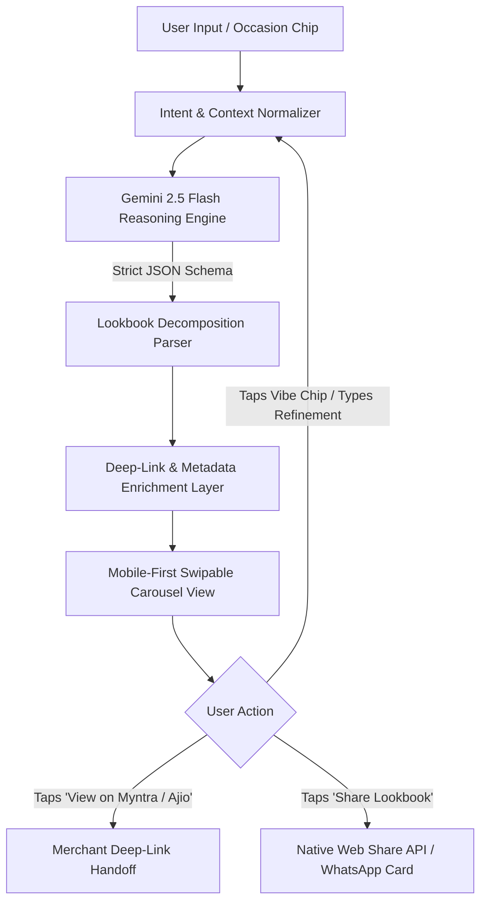

# 📄 Product Requirements Document (PRD)
## AI Shopping & Styling Assistant for Indian Gen Z & Millennials

**Document Version:** 1.0.0  
**Status:** Ready for Engineering Review  
**Target Delivery:** MVP (Sprint 1–2)  
**Author:** Principal Product Manager  
**Audience:** Engineering, Design, Growth/Marketing, Founders  

---

## 1. Executive Summary & Strategic Rationale

### 1.1 The Problem Statement
Indian Gen Z (18–26) and young Millennials (27–35) spend an average of **45–75 minutes and 15–25 browser tabs** across Myntra, Ajio, Amazon India, Nykaa, and D2C sites whenever they shop for an occasion (weddings, vacations, festive gatherings, housewarming gifts). 

Existing e-commerce platforms suffer from **Context-Blind Keyword Search**:
- Searching *"Goa outfit"* on Myntra yields 40,000+ uncurated floral shirts with zero understanding of day-to-night itinerary pacing, humidity suitability, or accessory matching.
- Multi-event Indian occasions (e.g., Haldi ➔ Sangeet ➔ Reception) require distinct thematic styling, yet users must reconstruct looks piecemeal across platforms.
- Gifting within specific social contexts (e.g., *"₹2.5k aesthetic housewarming gift for a colleague's 2BHK"*) leads to decision paralysis and default generic gift cards.

### 1.2 The Solution & Value Proposition
An AI-powered, mobile-first conversational styling companion that converts natural language intent (English & Hinglish) into **structured, thematic lookbooks presented as swipable card carousels**, paired with **1-tap outbound deep links** to trusted merchant apps.

### 1.3 Why Now? (Market Tailwinds)
1. **Fashion Discovery Gap**: Quick-commerce (Blinkit/Zepto) solved convenience; fashion e-commerce is drowning in catalog bloat. The next moat is *high-agency curation*.
2. **LLM Multimodal & Cultural Fluency**: Gemini 2.5 Flash natively understands Indian cultural taxonomy ("Haldi yellow", "Indo-western co-ord", "Bandra cafe aesthetic", "sundowner vibe") with sub-second JSON inference speeds.
3. **Zero-Operational Overhead (Pure Discovery Utility)**: By serving strictly as an intelligent discovery and styling companion, the product operates with **zero inventory, logistics, returns, or payment processing overhead**—focusing 100% of engineering and design resources on styling quality, retrieval speed, and user delight without commercial bias.

---

## 2. Product Principles & Guardrails

```
┌────────────────────────────────────────────────────────┐
│                   PRODUCT PRINCIPLES                   │
├────────────────────────────────────────────────────────┤
│ 1. Zero-Friction Discovery: Under 3 taps from prompt   │
│    to a high-fidelity curated outfit.                  │
│ 2. Stylist with an Opinion: Never dump raw lists;      │
│    always explain *why* an item works ("Stylist Note"). │
│ 3. Cultural & Contextual Fluency: Understand weather,  │
│    tradition, venue norms, and generational slang.     │
│ 4. Respect Existing Trust: Send users to buy on apps   │
│    where their address & UPI are already saved.        │
└────────────────────────────────────────────────────────┘
```

### 2.1 Scope Boundaries (Strict In/Out Matrix)

| In Scope (MVP) | Strict Out of Scope (Non-Goals) |
| :--- | :--- |
| Natural language prompt input + Occasion quick-chips | In-app shopping cart / multi-store universal checkout |
| Hinglish & contextual slang parsing | Payment processing or wallet integration |
| Multi-event decomposition (e.g., 3-day trip, 3 wedding events) | Inventory management, order tracking, or returns |
| Swipable visual carousel cards grouped by event tabs | Real-time dynamic budget meters / price recalculation engines |
| 1-tap deep links to Myntra, Ajio, Amazon, Nykaa | Direct supplier dropshipping or custom manufacturing |
| Conversational "Vibe Adjustments" (pills + chat refinement) | User account sign-ups / mandatory auth wall (keep it zero-barrier) |
| Organic WhatsApp Lookbook sharing | Monetization, affiliate tracking tags, ads, or sponsored listings (deferred) |

---

## 3. User Personas & Jobs-to-be-Done (JTBD)

### Persona A: "The Overwhelmed Wedding Guest" — Ananya (25, Product Designer, Bengaluru)
- **Context**: Attending her college friend's 3-day destination wedding in Udaipur.
- **Pain Points**: Needs 3 distinct fits (Haldi, Sangeet, Reception). Doesn't want heavy bridal lehengas; wants trendy, breathable Indo-western outfits she can dance in and reuse. Hates hunting across 6 apps for matching juttis and earrings.
- **JTBD**: *"When I am attending a multi-day wedding, I want a complete visual wardrobe breakdown with accessories, so that I look culturally appropriate and stylish without wasting my weekend scrolling through 500 catalog pages."*

### Persona B: "The Last-Minute Vacationer" — Kabir (27, Senior Analyst, Gurugram)
- **Context**: Going on a 4-day Goa trip with his friend group next Thursday.
- **Pain Points**: Owns standard gym tees and jeans. Has no idea what "sundowner aesthetic" or "resort wear" actually means. Wants complete outfits (shirt + shorts + footwear + sunglasses + sunscreen) with minimal effort.
- **JTBD**: *"When I book a beach trip, I want someone to hand me a ready-to-pack capsule wardrobe tailored to the itinerary, so that I look effortless in photos without overthinking my shopping."*

### Persona C: "The Aesthetic Gifter" — Rhea (23, Content Creator, Mumbai)
- **Context**: Invited to a friend's first apartment housewarming party with a ₹2,000–₹3,000 budget.
- **Pain Points**: Refuses to gift clichéd photo frames or Amazon gift cards. Wants something niche and Pinterest-worthy (e.g., ribbed ceramic vases, artisanal coffee press).
- **JTBD**: *"When I need an occasion-specific gift, I want tasteful, crowd-tested recommendations within my exact budget bracket, so that my gift feels thoughtful, aesthetic, and memorable."*

---

## 4. Core Success Metrics & Product KPIs

```
                      ┌─────────────────────────┐
                      │    North Star Metric    │
                      │  Outbound Intent Clicks │
                      │  (Qualified CTR to App) │
                      └────────────┬────────────┘
                                   │
         ┌─────────────────────────┴─────────────────────────┐
         ▼                                                   ▼
┌──────────────────┐                                ┌──────────────────┐
│ Discovery Engine │                                │ Experience & Eng │
├──────────────────┤                                ├──────────────────┤
│ Prompt-to-Curate │                                │ Lookbook Share   │
│ Rate: > 85%      │                                │ Rate: > 12%      │
│ P95 Render Time: │                                │ Vibe Adjustment  │
│ < 2.5s           │                                │ Rate: > 35%      │
└──────────────────┘                                └──────────────────┘
```

### 4.1 KPI Definitions
| Metric Tier | Metric Name | Target (MVP) | Measurement Formula |
| :--- | :--- | :--- | :--- |
| **North Star** | **Outbound Intent Click-Through Rate (O-CTR)** | **> 28%** | `(Total Clicks on "View on Merchant" / Total Carousels Viewed) * 100` |
| **Engagement** | Curation Completion Rate | > 80% | `% of users who view at least 2 event tabs in a generated lookbook` |
| **Engagement** | Vibe Refinement Rate | 30% – 45% | `% of sessions executing at least 1 prompt tweak (pill or text)` |
| **Quality** | Link Reliability / Hallucination Rate | < 2% | `Broken search queries or dead-end search queries / Total deep links generated` |
| **Performance** | Time-to-First-Card (TTFC) | < 2.0s | P95 duration from user prompt submission to initial carousel paint |

---

## 5. Functional Specifications & Feature Breakdown



---

### Feature 5.1: Conversational Input & Quick-Discovery Chips
#### Description
A sticky, thumb-friendly input interface allowing free-form input in English or Hinglish, flanked by 1-tap occasion accelerator chips.

#### Specifications
- **Quick-Start Chips (Horizontal Scroll)**:
  - 🌴 *Goa 3-Day Vibe*
  - 🪔 *Jaipur Wedding Guest (3 Looks)*
  - ☕ *Cafe & Co-working Casuals*
  - 🎁 *Aesthetic Housewarming (<₹2.5k)*
  - 🛋️ *Cozy WFH Desk Setup*
- **Text Area**: Auto-expanding input box (max 250 characters) with conversational placeholder cycling:
  - *"E.g., 3-day Goa trip with college friends..."*
  - *"E.g., Best friend's Haldi & Sangeet outfit under ₹4,000..."*
  - *"E.g., Housewarming gift for coffee lovers..."*
- **Language & Slang Handling**: Must parse Indian cultural vocabulary without failure:
  - Event terms: *Haldi, Mehendi, Sangeet, Roka, Cocktail, Pooja, Sundowner, Brunch.*
  - Style keywords: *Indo-western, Chikankari, Oversized drip, Old money, Co-ord, Kurtis, Minimalist, Aesthetic.*

---

### Feature 5.2: Multi-Event Decomposition Engine
#### Description
Transforms single-line inputs into chronological, contextualized sub-events rather than a flat product catalog.

#### Business Logic & Rules
1. If the input contains a multi-day trip or multi-event ceremony, the engine **must partition output into 3 to 4 logical sub-event tabs**:
   - *Example (Goa Trip)*: `[Day 1: Beach & Shacks]`, `[Day 2: Sundowner & Yacht]`, `[Day 3: Club Night]`, `[Packing Essentials]`.
   - *Example (Wedding)*: `[Event 1: Haldi]`, `[Event 2: Sangeet]`, `[Event 3: Reception]`, `[Jewelry & Footwear]`.
2. Each sub-event tab must contain **3 to 5 curated items** creating a coherent head-to-toe look:
   - Primary garment (e.g., Cuban collar shirt / Anarkali suit)
   - Bottomwear or coordinating piece (e.g., Linen drawstring pants / Juttis)
   - Accessory / Footwear / Grooming (e.g., Retro sunglasses, Sunscreen stick, Statement earrings)
3. Every recommendation must include a **1-sentence "Stylist Note"** justifying fabric choice, weather suitability, or styling tips.

---

### Feature 5.3: Curated Swipable Carousel & Card Component
#### Specifications & Layout
- **Container**: Horizontal scroll-snap container with touch-optimized physics (`framer-motion` / CSS scroll-snap-x mandatory).
- **Card Data Anatomy**:

```
+-------------------------------------------------------------+
| [ Curated High-Res Visual / Aesthetic Unsplash / CDN Image ] |
|                                                             |
| Tag: [MYNTRA]  ·  ~₹1,299                                   |
| Textured Cuban Collar Rayon Shirt                           |
|                                                             |
| 💡 Stylist Note:                                             |
| "Breathable open-weave rayon keeps you cool in humid beach   |
| weather; pair with off-white drawstring linen trousers."    |
|                                                             |
| [ View on Myntra ↗ ]  <-- High-contrast primary CTA         |
+-------------------------------------------------------------+
```

- **Price Tag Format**: Clear indicator with approximation prefix (`~₹1,499`), preventing broken trust if real-time merchant pricing fluctuates by ₹50–₹100.
- **Image Fallback Strategy**:
  1. Priority 1: High-affinity curated editorial fashion asset from CDN cache.
  2. Priority 2: Unsplash fashion collection matching the keyword (e.g., `linen-shirt-mens-fashion`).
  3. Priority 3: Clean typographic vector gradient card with aesthetic icon.

---

### Feature 5.4: Conversational "Vibe Adjustment" Engine
#### Description
Permits instant iterative refinement without forcing the user to restart or re-type the entire prompt.

#### Specifications
- Dynamically rendered refinement pills beneath the carousel based on current context:
  - *Current context: Goa Trip* ➔ Pills: `["More budget-friendly (<₹999)"]`, `["Switch to streetwear vibe"]`, `["More pastel & neutral colors"]`, `["Add swimwear & slides"]`.
  - *Current context: Wedding Guest* ➔ Pills: `["More modern Indo-western"]`, `["Keep it strictly under ₹3,000"]`, `["Comfortable dance-friendly footwear"]`.
- When tapped, the system maintains session memory (event structure, city, duration) and recalculates only the styling parameters.

---

### Feature 5.5: Deep-Linking & Merchant Handoff Engine
#### Description
Generates zero-friction links opening the native merchant app on iOS/Android or falling back gracefully to mobile web.

#### Deep-Link Formatting Rules

| Merchant | Deep-Link URL Pattern | Fallback / Web URL | Target Category Filters |
| :--- | :--- | :--- | :--- |
| **Myntra** | `myntra://search?q={encoded_query}` | `https://www.myntra.com/{slug-query}?f=Gender%3Amen%2Cwomen` | Injected gender & sort by popularity |
| **Ajio** | `ajio://search/{encoded_query}` | `https://www.ajio.com/search/?text={encoded_query}` | Native app intent handler |
| **Amazon IN** | `amazon://s?k={encoded_query}` | `https://www.amazon.in/s?k={encoded_query}` | Direct search query without tracking |
| **Nykaa** | `nykaa://search/{encoded_query}` | `https://www.nykaa.com/search/result/?q={encoded_query}` | Beauty, grooming & fragrance |

#### Query Optimization Algorithm
The engine converts creative stylistic phrases into **high-conversion merchant search terms**:
- *Stylist Concept*: "Effortless resort sundowner linen shirt"
- *Optimized Deep-Link Query*: `men resort camp collar beige linen shirt`
- *Rationale*: Avoids keyword starvation on merchant search engines while retaining specific aesthetic filters.

---

## 6. System Architecture & Data Contracts

### 6.1 Architecture Diagram (n8n Workflow Backend)

```
+---------------------------------------------------------------+
|                      Client Layer (PWA/Web)                   |
|  Next.js 15 App Router | Tailwind CSS | Framer Motion         |
|  - UI State: Active Lookbook, Selected Tab, Vibe Chips        |
|  - Clean Deep-Link Dispatcher (Direct Merchant URL Schemes)   |
+------------------------------+--------------------------------+
                               | HTTPS POST (JSON: prompt, vibeContext)
+------------------------------v--------------------------------+
|                   n8n Workflow Automation Backend             |
|                                                               |
|  [ Webhook Trigger ]                                          |
|         │                                                     |
|         ▼                                                     |
|  [ Gemini 2.5 Flash AI Node ]                                 |
|  - System Prompt: Senior Stylist & Cultural Trend Curator     |
|  - Structured Output: LookbookResponseSchema (Strict JSON)    |
|         │                                                     |
|         ▼                                                     |
|  [ Code Node: Deep-Link & Query Formatter ]                   |
|  - Sanitizes search queries for Myntra, Ajio, Amazon, Nykaa   |
|  - Injects direct mobile app URL schemes                      |
|         │                                                     |
|         ▼                                                     |
|  [ Respond to Webhook Node ]                                  |
|  - Returns formatted, validated JSON payload to Next.js       |
+---------------------------------------------------------------+
```

#### n8n Backend Pipeline Specifications
1. **Webhook Trigger Node**: Listens on `POST /webhook/curate`, accepting payload `{ "prompt": string, "vibeContext": string | null, "activeCategory": string | null }`.
2. **Gemini 2.5 Flash Node**: Executes with model `gemini-2.5-flash`, temperature `0.3` (for styling consistency), and native JSON schema output enforcement.
3. **Deep-Link Generator (Code Node)**: Formats clean search deep-links for each merchant without tracking tags or redirect middleware.
4. **Respond to Webhook Node**: Returns HTTP 200 with the clean `LookbookResponse` JSON directly to the frontend.

---

### 6.2 Gemini Structured Output Contract (JSON Schema)

Every LLM generation must strictly conform to the following schema to prevent UI rendering errors:

```json
{
  "$schema": "http://json-schema.org/draft-07/schema#",
  "title": "LookbookResponse",
  "type": "object",
  "required": ["lookbookTitle", "tagline", "cityOrSetting", "occasionCategory", "tabs", "suggestedRefinementPills"],
  "properties": {
    "lookbookTitle": {
      "type": "string",
      "description": "Catchy title, e.g., '🌴 3-Day Goa Coastal Capsule'"
    },
    "tagline": {
      "type": "string",
      "description": "Short aesthetic summary, e.g., 'Breezy linens, sundowner tones, and club-ready drip'"
    },
    "cityOrSetting": {
      "type": "string",
      "description": "Extracted or inferred location, e.g., 'Goa, India'"
    },
    "occasionCategory": {
      "type": "string",
      "enum": ["vacation", "wedding", "gifting", "home_decor", "casual_lifestyle"]
    },
    "tabs": {
      "type": "array",
      "minItems": 2,
      "maxItems": 4,
      "items": {
        "type": "object",
        "required": ["tabId", "tabTitle", "tabIcon", "items"],
        "properties": {
          "tabId": { "type": "string", "example": "day-1-beach" },
          "tabTitle": { "type": "string", "example": "Day 1: Beach & Shacks" },
          "tabIcon": { "type": "string", "example": "🌊" },
          "items": {
            "type": "array",
            "minItems": 3,
            "maxItems": 5,
            "items": {
              "type": "object",
              "required": [
                "itemId",
                "itemName",
                "category",
                "approxPriceINR",
                "primaryPlatform",
                "stylistNote",
                "merchantSearchQuery",
                "imageKeyword"
              ],
              "properties": {
                "itemId": { "type": "string" },
                "itemName": { "type": "string", "example": "Oversized Crochet Resort Shirt" },
                "category": { 
                  "type": "string", 
                  "enum": ["apparel", "footwear", "accessory", "grooming_beauty", "decor_gift"] 
                },
                "approxPriceINR": { "type": "integer", "example": 1199 },
                "primaryPlatform": { 
                  "type": "string", 
                  "enum": ["Myntra", "Ajio", "Amazon", "Nykaa", "Snitch", "Westside"] 
                },
                "stylistNote": { 
                  "type": "string", 
                  "description": "Max 25 words explaining why this piece works." 
                },
                "merchantSearchQuery": { 
                  "type": "string", 
                  "description": "High-intent search query for merchant app deep linking." 
                },
                "imageKeyword": { 
                  "type": "string", 
                  "description": "Visual keyword for CDN image matching." 
                }
              }
            }
          }
        }
      }
    },
    "suggestedRefinementPills": {
      "type": "array",
      "items": { "type": "string" },
      "minItems": 3,
      "maxItems": 4
    }
  }
}
```

---

## 7. Non-Functional Requirements (NFRs)

### 7.1 Performance & Latency
- **Time to Interactive (TTI)**: < 1.5s on 4G mobile networks across Indian Tier 1/2 cities.
- **LLM Pipeline Latency**: Complete JSON response generated by n8n + Gemini in **< 2,200 ms**.

### 7.2 Mobile Ergonomics & Viewport
- **Primary Design Viewport**: 375px to 428px (iPhone 13–16, Samsung Galaxy S series, Redmi/OnePlus devices).
- **One-Handed Navigation**: All critical touch targets (Input bar, Send button, Carousel cards, Tab switches) positioned within the thumb zone (bottom 60% of viewport).

### 7.3 Privacy & Data Safety
- **No Mandatory Login for MVP**: Frictionless first-session experience. User preference state stored in `localStorage`.
- **Zero PII Storage**: Prompts stripped of personal identifiers before passing to LLM APIs.
- **Prompt Safety Guardrails**: Guard against inappropriate content, offensive language, or non-shopping queries using lightweight prompt checks.

---

## 8. Organic Growth & User Experience Loops

> [!NOTE]
> **Product Direction Note**: All commercialization mechanisms (affiliate networks, CPC sponsorships, ad placements) are strictly **deferred** until product-market fit (PMF) and organic adoption thresholds are met. 100% of focus is currently on curation fidelity and user utility. Analytics instrumentation and local history are also excluded from MVP scope to maximize shipping velocity.

### 8.1 "Share-to-WhatsApp" Trip & Wedding Capsule Loop
- Indian vacation and wedding outfit shopping is inherently collaborative (friends and cousins validating looks in WhatsApp groups).
- **Feature**: 1-tap **"Share Capsule on WhatsApp"**:
  - Triggers native Web Share API with a clean pre-filled WhatsApp message containing the occasion title, summary, and direct link.
  - Recipients can view the exact lookbook, swipe through the cards, and tap "Remix this Vibe" to generate their own variations.

### 8.2 Zero-Redirect Friction
- Outbound buttons link **directly and cleanly** into native merchant app search schemas (Myntra, Ajio, Amazon, Nykaa).
- No intermediate redirect hops, tracking scripts, or latency overhead—ensuring immediate, uninterrupted user gratification.

---

## 9. Re-Architected MVP Roadmap (n8n + Next.js Stack)

By leveraging **n8n as the workflow orchestration backend**, backend development velocity increases significantly—eliminating custom server setup, custom queue handling, and complex API boilerplate.

```
┌────────────────────────────────────────────────────────────────────────────┐
│                    PHASED MVP ROADMAP (2-WEEK SPRINT CYCLE)                │
├────────────────────────────────────────────────────────────────────────────┤
│ Track A: n8n Backend Workflow Engine                                       │
│ Track B: Next.js Mobile-First Frontend & Carousels                         │
│ Track C: End-to-End Integration, Handoff & Edge-Case QA                    │
└────────────────────────────────────────────────────────────────────────────┘
```

### Sprint 1: Foundation & Core Engines (Days 1–5)

#### Track A: n8n Workflow Backend
- [x] **Setup n8n Instance**: Deploy n8n workflow engine (cloud or self-hosted) with public Webhook URL.
- [ ] **Webhook Ingestion Node**: Create `POST /webhook/curate` receiving `{ prompt, vibeContext, activeCategory }`.
- [ ] **Gemini 2.5 Flash Integration**: Configure AI Node with Google Gemini credentials, system styling prompt, temperature (`0.3`), and native JSON Schema output mode.
- [ ] **Prompt Engineering & Slang Tuning**: Embed cultural dictionary directly into Gemini prompt (Haldi, Mehendi, Sangeet, Co-ord, Chikankari, Drip, Old Money).
- [ ] **Test Output Compliance**: Verify 100% adherence to `LookbookResponseSchema` across 20 diverse Indian test prompts.

#### Track B: Next.js Frontend Shell
- [ ] **Project Setup**: Scaffold Next.js 15 app with Tailwind CSS and mobile-first container constraints (`max-w-md mx-auto`).
- [ ] **Conversational Input Header**: Build sticky bottom/top input with auto-growing textarea and active state transitions.
- [ ] **Quick-Discovery Occasion Chips**: Implement horizontally scrollable chips (🌴 Goa, 🪔 Wedding Guest, 🎁 Housewarming, 🛋️ Desk Setup).
- [ ] **Framer Motion Carousel Component**: Build touch-friendly horizontal scroll-snap carousel with smooth swipe physics.
- [ ] **Curated Card UI**: Implement card layout with title, platform tag, price indicator, stylist note, and "Priority 3" CSS gradient fallback for missing images.

---

### Sprint 2: Deep-Linking, Integration & Refinement (Days 6–10)

#### Track A: n8n Query Transformation Node
- [ ] **Deep-Link Formatter (n8n Code Node)**: Add JavaScript function node to sanitize Gemini item names into high-intent merchant search queries:
  - Myntra: `myntra://search?q={query}` (fallback: web URL)
  - Ajio: `ajio://search/{query}` (fallback: web URL)
  - Amazon: `amazon://s?k={query}` (fallback: web URL)
  - Nykaa: `nykaa://search/{query}` (fallback: web URL)
- [ ] **Webhook Response Node**: Package final transformed JSON and return HTTP 200 within <2.2s.

#### Track B: Frontend Integration & Refinement
- [ ] **Connect Frontend to n8n**: Wire Next.js client to the n8n webhook endpoint with loading skeleton states.
- [ ] **Event Tab Switching**: Smooth tab navigation between sub-events (e.g., Beach ➔ Sundowner ➔ Club Night ➔ Essentials).
- [ ] **Vibe Refinement Engine**: Wire suggested refinement pills to trigger follow-up payload to n8n with `vibeContext`.
- [ ] **Native WhatsApp Share**: Connect native Web Share API to 1-tap "Share Lookbook" button.

---

### Sprint 3: Verification & User Testing (Days 11–14)

- [ ] **Mobile Device QA**: Test on physical iOS (Safari) and Android (Chrome) devices for deep-link app-switching behavior.
- [ ] **Latency Benchmark**: Validate that total round-trip (Next.js ➔ n8n ➔ Gemini ➔ n8n ➔ Next.js) meets the **< 2.5s P95 target**.
- [ ] **Content QA**: Test the 4 flagship scenarios (Goa, Wedding Guest, Gifting, WFH Room) with 20 real users to evaluate styling taste.
- [ ] **Deployment**: Host Next.js frontend on Vercel; connect production n8n webhook.

---

## 10. Edge Cases & Operational Mitigations

| Edge Case | Failure Mode | Product Mitigation Strategy |
| :--- | :--- | :--- |
| **Out-of-Stock Products** | Specific product link leads to 404 or sold-out item. | **Never link to static SKU IDs.** Deep-link to curated, high-intent filtered search queries (e.g., `brand + fabric + color + garment`). This guarantees the user lands on available in-stock alternatives. |
| **Price Volatility** | Flash sale ends; displayed price is higher or lower than merchant app. | Prefix all prices with approximate indicators (`~₹1,299`). Include disclaimer in card footer: *"Prices on merchant sites may vary based on live offers."* |
| **Broad / Ambiguous Prompt** | User types single word: *"Party"*. | Inject a rapid 1-tap clarifying disambiguation card: *"What kind of party? [House Party] [Wedding Cocktail] [Club Night] [Dinner Date]"*. |
| **Unrealistic Budget Constraints** | User prompts: *"Designer bridal lehenga under ₹500"*. | Graceful stylist feedback: *"Real talk: High-quality bridal wear under ₹500 isn't available, but here are stunning rental options and dupattas to elevate existing outfits under ₹1,500."* |
