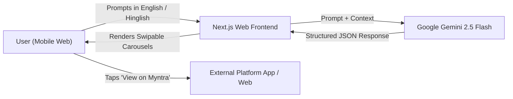

# 🛍️ Project Masterplan: AI Shopping & Styling Assistant for Indian Gen Z & Millennials

---

## 1. Executive Summary & Core Mission

### The Vision
Build a **zero-fuss, conversational shopping and styling assistant** tailored specifically to the lifestyle, aesthetics, and cultural nuances of Indian Gen Z and millennials.

### The Elevator Pitch
> *"Stop opening 20 browser tabs across Myntra, Ajio, and Amazon. Tell the AI your occasion, budget, and vibe, and get an instant curated lookbook and essentials list with direct links to buy on the platforms you already trust."*

### What Makes This Unique
Instead of acting as another e-commerce storefront or an overwhelming search engine, this assistant acts as a **knowledgeable digital personal shopper**. It understands the anatomy of Indian occasions (e.g., a 3-day beach trip, a friend's Haldi ceremony, or an aesthetic housewarming gift) and curates complete, visually cohesive collections in swipable card carousels.

---

## 2. Target Audience & Cultural Insights

### Primary Audience
* **Demographics**: Indian Gen Z (18–26) and younger Millennials (27–35) living in Tier 1 & Tier 2 cities (Bangalore, Mumbai, Delhi-NCR, Pune, Hyderabad, Jaipur, etc.).
* **Device Dominance**: 90%+ Mobile-first / App-first shoppers.
* **Preferred Platforms**: Myntra, Ajio, Amazon India, Nykaa, Urbanic, Snitch, Bewakoof, Westside, Tata CLiQ.

### Core Behavioral Pain Points
1. **Decision Fatigue & Browser Overwhelm**: Searching for an outfit for a trip or wedding requires bouncing between dozens of product pages, cross-checking sizes, vibes, and delivery dates.
2. **Context-Blind Keyword Search**: Traditional e-commerce search boxes don't understand context. Searching *"Goa outfit"* simply returns thousands of random printed shirts without styling guidance or activity coordination.
3. **Wedding Season Stress**: Attending an Indian wedding means needing 3 to 5 distinct outfits (Haldi, Mehendi, Sangeet, Cocktail, Reception), each with different dress codes, fabrics, and aesthetics.
4. **Gifting Paralysis**: Finding a memorable, aesthetic gift for a colleague's wedding, housewarming, or friend's birthday within a budget is frustrating, often ending in cliché gift cards.

---

## 3. Product Principles & Scope Boundaries

```
┌────────────────────────────────────────────────────────┐
│                      WHAT WE ARE                       │
├────────────────────────────────────────────────────────┤
│  ✔ Pure styling & discovery assistant                  │
│  ✔ Intelligent occasion & packing breakdown            │
│  ✔ Curated visual carousel lookbooks                   │
│  ✔ 1-tap direct outbound deep links to trusted sites   │
└────────────────────────────────────────────────────────┘

┌────────────────────────────────────────────────────────┐
│                    WHAT WE ARE NOT                     │
├────────────────────────────────────────────────────────┤
│  ✖ No shopping carts or multi-item checkout            │
│  ✖ No selling items or collecting payments             │
│  ✖ No inventory holding or logistics management        │
│  ✖ No budget meters / price calculation meters         │
└────────────────────────────────────────────────────────┘
```

---

## 4. The Four Flagship Verticals

### 🌴 1. Vacation & Travel Packing (e.g., Goa, Manali, Pondicherry)
* **User Query**: *"Going to Goa for 3 days with friends. Need full outfit ideas and essentials."*
* **AI Output Breakdown**:
  * **Day 1 (Beach / Shacks)**: Breezy linen shirts, swim shorts, relaxed slides.
  * **Day 2 (Sundowner Cruise)**: Textured crochet co-ords, polarized sunglasses, tote bags.
  * **Day 3 (Club Night / Party)**: Camp collar retro prints, slip dresses, sneakers.
  * **Travel Essentials**: Sunscreen sticks, quick-dry microfibre towels, waterproof phone pouches.

### 🪔 2. The Multi-Event Indian Wedding Guest
* **User Query**: *"Attending my best friend's wedding in Jaipur. Need looks for Haldi, Sangeet, and Reception."*
* **AI Output Breakdown**:
  * **Haldi**: Breathable mustard yellow kurta/Anarkali with minimal floral embroidery + juttis.
  * **Sangeet**: Indo-western open jacket set / mirror-work lehenga suited for dancing comfortably.
  * **Reception**: Structured raw silk bandhgala or classic embroidered cocktail saree.
  * **Styling Tips**: Jewelry pairing advice and fabric breathability suggestions for the venue.

### 🎁 3. Occasion & Personality-Based Gifting
* **User Query**: *"Aesthetic housewarming gift for a millennial couple moving into a 2BHK in Bangalore, budget around ₹2,000 to ₹3,000."*
* **AI Output Breakdown**:
  * **Home Decor**: Minimalist ribbed ceramic vase with dried pampas grass.
  * **Coffee & Kitchen**: French press paired with an artisanal specialty coffee sampler.
  * **Ambience**: Soy-wax scented candle set with a brass wick trimmer.

### 🛋️ 4. Room Aesthetic & Home Decor Makeovers
* **User Query**: *"Want to set up an aesthetic, cozy WFH desk corner in my bedroom."*
* **AI Output Breakdown**:
  * **Lighting**: Warm LED monitor light bar or sunset projection lamp.
  * **Desk Accessories**: Felt wool desk mat, Scandinavian wooden cable organizer.
  * **Greenery**: Low-maintenance indoor plant (Snake plant or ZZ plant in a ceramic planter).

---

## 5. UI/UX: The "Curated Carousel" Design

### Mobile-First Layout
```
+-----------------------------------------------------------------------------------+
|  🌴 Goa 3-Day Vibe Pack                                                           |
|  "Breezy linens, sundowner tones, and coastal essentials"                         |
+-----------------------------------------------------------------------------------+
|  [Tabs: 🌊 Beach & Shacks  |  🌅 Sunset Party  |  🪩 Club Night  |  🧴 Essentials]  |
+-----------------------------------------------------------------------------------+
|                                                                                   |
|  +-----------------------+   +-----------------------+   +----------------------+ |
|  | [ Image ]             |   | [ Image ]             |   | [ Image ]            | |
|  | Cuban Collar Shirt    |   | Drawstring Linen Pant |   | Retro Oval Shades    | |
|  | ~₹899                 |   | ~₹1,299               |   | ~₹499                | |
|  |                       |   |                       |   |                      | |
|  | 💡 "Lightweight rayon |   | 💡 "Breathable fabric |   | 💡 "90s retro vibe;  | |
|  | stays cool in daytime |   | for beach shacks"     |   | UV400 protection"    | |
|  | humidity"             |   |                       |   |                      | |
|  |                       |   |                       |   |                      | |
|  | [ View on Myntra ↗ ]  |   | [ View on Ajio ↗ ]    |   | [ View on Amazon ↗ ] | |
|  +-----------------------+   +-----------------------+   +----------------------+ |
|                                                                                   |
|  ⚡ Quick Vibe Adjustments:                                                        |
|  [ "Show more pastel colors" ]  [ "Make it more streetwear" ]  [ "More budget-friendly" ] |
+-----------------------------------------------------------------------------------+
```

### Card Component Specifications
Every card in the carousel contains:
1. **High-Resolution Thumbnail**: Clear visual preview of the aesthetic/item.
2. **Item Title**: Concise name with platform indicator (Myntra, Ajio, Amazon, etc.).
3. **Price Indicator**: Approximate price tag (e.g., `~₹899`) for buyer expectation.
4. **Stylist Note**: 1-sentence tip on why this item was picked and how to pair it.
5. **Direct Action Button**: `[ View on Myntra ↗ ]` deep-linking directly to the app/website.

---

## 6. Technical Architecture



### Frontend
* **Framework**: Next.js (React 19) + Tailwind CSS + Framer Motion.
* **Layout**: Mobile-first responsive app shell with touch gestures (swipe left/right for carousel items).
* **Interactions**: Pre-set occasion chips ("🌴 Goa Trip", "🪔 Wedding Guest", "🎁 Housewarming Gift") for quick discovery.

### LLM Intelligence Layer
* **Model**: **Google Gemini 2.5 Flash** (ultra-fast generation, strong Hinglish & cultural understanding).
* **Output Format**: Native JSON Schema (`response_schema`), ensuring deterministic parsing of occasion titles, categories, and item metadata.

### Deep-Linking Strategy
* The backend generates direct search/category deep-links with appropriate filters:
  * Myntra: `https://www.myntra.com/{search-query}`
  * Ajio: `https://www.ajio.com/search/?text={search-query}`
  * Amazon: `https://www.amazon.in/s?k={search-query}`
* On mobile devices, these URLs automatically launch the user's installed shopping app directly to the relevant products.

---

## 7. MVP Development Roadmap

```
Week 1: UI Shell & Visual Carousels
├── Setup Next.js + Tailwind project
├── Build chat window with prompt input & quick-vibe chips
└── Build responsive, swipable card carousels with tabs

Week 2: Gemini Intelligence & Deep-Linking
├── Integrate Gemini 2.5 Flash API with JSON Schema
├── Engineer occasion-aware styling system prompts
├── Connect deep-link generators for Myntra, Ajio, Amazon, and Nykaa
└── User testing & refinement for Goa, Wedding, and Gift scenarios
```
